<div align="center">
  <h1>🛡️ AgentBreak</h1>
  <p><b>Workflow-level security scanner for multi-agent AI systems.</b></p>

  [](https://www.python.org/)
  [](https://opensource.org/licenses/MIT)
</div>

---

## 📖 Overview

**AgentBreak** is a specialized security scanning framework designed to audit multi-agent AI workflows. Unlike traditional security tools that test single endpoints, AgentBreak parses entire AI orchestration workflows (such as those built with LangGraph or CrewAI) and statically/dynamically analyzes them for injection vulnerabilities, unauthorized tool executions, and data leaks.

## ✨ Key Features

- **Multi-Framework Parsers**: Natively parses `LangGraph`, `CrewAI`, or generic YAML/JSON workflow schemas.
- **Graph-Based Attack Pathfinding**: Employs Depth-First Search (DFS) over a unified `ToolGraph` to map out all possible exploit paths.
- **Dynamic Payload Generation**: Automatically generates context-aware injection payloads based on predefined severity and trust levels.
- **Comprehensive Reporting**: Outputs detailed traces in `JSONL` and rich, visual timelines in `HTML` (with SVG graphs).
- **Extensible Architecture**: Easily add new parsers for other multi-agent frameworks or new security scanners.

## 🏗️ Architecture

AgentBreak operates in a pipeline:

1. **Parsers**: Ingests your AI framework definitions and converts them into a standardized `ToolGraph`.
2. **Scanner Engine**: Traverses the `ToolGraph` to find vulnerable nodes and edges, applying simulated attacks using dynamically generated payloads.
3. **Core Models**: Shared schema models governing attack paths, trust boundaries, and enums.
4. **Output/Reporting**: Generates the final audit reports.



## 📂 Project Structure

```text
agentbreak/
├── agentbreak/                  # Core package
│   ├── models/                  # Pydantic schemas and Enums (ToolGraph, AttackPath, etc.)
│   ├── parsers/                 # Framework parsers (LangGraph, CrewAI, JSON/YAML)
│   ├── scanner/                 # Engine (PathFinder, Payload Generator, Executor)
│   └── output/                  # Reporters (JSONL, HTML)
├── cli.py                       # CLI Entrypoint
├── pyproject.toml               # Build and Dependency definitions
└── README.md                    # You are here!
```

## ⚙️ Installation

AgentBreak requires **Python 3.10+**.

### Basic Installation
Clone the repository and install it directly:
```bash
git clone https://github.com/JaleedAhmad/agentbreak.git
cd agentbreak
pip install -e .
```

### Optional Dependencies
Depending on the AI framework you are scanning, install the optional dependencies:
```bash
# To scan LangGraph applications
pip install -e ".[langgraph]"

# To scan CrewAI applications
pip install -e ".[crewai]"

# For development and testing
pip install -e ".[dev]"
```

## 🚀 Usage

> **Note**: AgentBreak is currently in active development. Detailed usage examples will be provided once the CLI is finalized.

Currently, you can invoke the primary entrypoint (once implemented) like this:

```bash
agentbreak --help
```

*More examples on scanning specific graphs and configuring policies will be added soon.*

## 📝 License

This project is licensed under the MIT License - see the `LICENSE` file for details.
